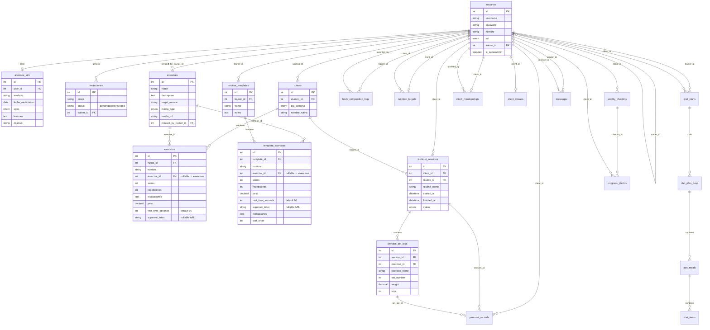

# Esquema de base de datos

Base: `coach_db` (MySQL, utf8mb4). Fuente canónica del DDL: [`backend/db/script_db.sql`](../backend/db/script_db.sql).

## Diagrama de relaciones



## Tablas

### `usuarios`

Login y ownership trainer↔cliente. `rol`: `trainer` | `client`. Los clientes pueden tener `trainer_id` apuntando a su entrenador. `is_superadmin` (BOOLEAN, default FALSE) es el flag de dueño de plataforma (Feature 037); no es un tercer rol.

### `alumnos_info`

Perfil extendido del alumno (Feature 020). Relación 1:1 con `usuarios` vía `user_id` (UNIQUE). Campos: `telefono`, `fecha_nacimiento`, `sexo`, `lesiones`, `objetivo`, `foto_url`, `ultimo_acceso`. `foto_url` guarda ruta relativa (`/uploads/avatars/user_<id>.jpg`) o `NULL` (avatar por defecto en frontend).

### `trainers_info`

Perfil extendido del entrenador (Feature 024 + 037). Relación 1:1 con `usuarios` vía `user_id` (UNIQUE). Campos: `telefono`, `foto_url`, `saas_plan` (`FREE`|`PRO`, default `FREE`), `saas_expiration_date` (DATE NULL). El nombre sigue en `usuarios.nombre`.

### `rutinas`

Rutina diaria asignada a un alumno (`alumno_id` → `usuarios`).

### `ejercicios` (líneas de rutina)

Detalle de una rutina concreta: nombre (denormalizado), series, repeticiones, peso, `rest_time_seconds` (Feature 028; default 90), `superset_letter` (Feature 029) e indicaciones. **No** es el catálogo del sistema. El peso aquí es **prescripción**, no historial de ejecución.

**Feature 022:** `exercise_id INT NULL` → FK a `exercises(id)` con `ON DELETE SET NULL`. Si el catálogo borra un ejercicio, la línea de rutina permanece con `nombre` intacto y `exercise_id = NULL`.

**Feature 028:** `rest_time_seconds INT NOT NULL DEFAULT 90` — descanso entre series (0–900). Migración: [`backend/db/migrations/012_rest_time_seconds.sql`](../backend/db/migrations/012_rest_time_seconds.sql). Misma columna en `template_exercises` (se copia al asignar).

**Feature 029:** `superset_letter VARCHAR(2) NULL` — letra de grupo superserie/circuito (ej. `A`, `B`). Migración: [`backend/db/migrations/013_superset_letter.sql`](../backend/db/migrations/013_superset_letter.sql). Misma columna en `template_exercises` (se copia al asignar).

### `exercises` (catálogo / diccionario)

Diccionario híbrido de ejercicios (Feature 008 + **044**):

| Columna | Descripción |
|---------|-------------|
| `id` | PK |
| `name` | Nombre del ejercicio (EN / canónico seed) |
| `name_es` | Nombre en español (nullable; scraping Fitcron) |
| `description` | Descripción opcional (EN) |
| `description_es` | Descripción en español (nullable) |
| `target_muscle` | Grupo muscular objetivo |
| `target_muscle_es` | Grupo muscular en español (nullable) |
| `primary_muscle` | Músculo principal taxonomía HITL (nullable) |
| `secondary_muscles` | JSON array de músculos secundarios (nullable) |
| `is_warmup` | `TINYINT(1)` — 1 = usable como calentamiento para esa musculatura |
| `media_type` | `image` \| `gif` \| `youtube` \| `video` \| `none` |
| `media_url` | URL de media externa (fallback; seed wrkout / YouTube) |
| `local_media_path` | Ruta relativa hosteada, ej. `/uploads/exercises/exercise_12.gif` |
| `created_by_trainer_id` | `NULL` = global del sistema; con ID = privado del trainer (`usuarios.id`) |

Migración i18n: [`backend/db/migrations/024_exercises_i18n_local_media.sql`](../backend/db/migrations/024_exercises_i18n_local_media.sql).  
Migración HITL tags: [`backend/db/migrations/025_exercises_muscle_tags.sql`](../backend/db/migrations/025_exercises_muscle_tags.sql) (`npm run db:add-exercises-muscle-tags`).  
Scraping + descarga: [`docs/exercises-i18n-scraping.md`](exercises-i18n-scraping.md).  
UI etiquetado: `/admin/exercises/tagger` (superadmin).

**Importante:** `exercises` ≠ `ejercicios`. Las líneas de rutina/plantilla pueden vincularse con `exercise_id` (estable) y siguen guardando `nombre` para display e historial (Feature 022). La UI del trainer elige del catálogo vía `GET/POST /api/exercises`.

### `workout_sessions` / `workout_set_logs` (Feature 012)

Ejecución del alumno. `workout_sessions` agrupa una sesión; `workout_set_logs` guarda peso/reps por serie. No reescribe la prescripción.

### `invitaciones`

Tokens de registro generados por un trainer (`trainer_id`). Columna `status`: `pending` | `used` | `revoked` (Feature 023; reemplaza `usado` BOOLEAN).

Migración: [`backend/db/migrations/009_invites_status.sql`](../backend/db/migrations/009_invites_status.sql).

```bash
cd backend
node scripts/migrateInvitesStatus.js
```

### `routine_templates` / `template_exercises` (Feature 018)

Biblioteca personal del trainer. `routine_templates.trainer_id` aísla ownership. Las líneas viven en `template_exercises` con `exercise_id` opcional → `exercises` (Feature 022, `ON DELETE SET NULL`).

**Deep copy:** al asignar (`POST /templates/:id/assign`) se insertan filas nuevas en `rutinas` + `ejercicios` del alumno (incluye `exercise_id`, `rest_time_seconds` y `superset_letter` si existen). No hay FK plantilla↔rutina; editar/borrar la plantilla no muta rutinas ya asignadas.

Migración catálogo link: [`backend/db/migrations/008_exercise_catalog_link.sql`](../backend/db/migrations/008_exercise_catalog_link.sql).

```bash
cd backend
node scripts/createExerciseCatalogLink.js
```

Migración plantillas: [`backend/db/migrations/005_routine_templates.sql`](../backend/db/migrations/005_routine_templates.sql).

```bash
cd backend
node scripts/createRoutineTemplatesTables.js
```

### `body_composition_logs` (Feature 026)

Historial antropométrico N:1 con el cliente (`client_id` → `usuarios`). `recorded_by` → trainer que registró. `bmi` se calcula en el backend (`weight_kg / (height_cm/100)²`); no se confía en el valor del cliente. Circunferencias y `% grasa` opcionales; todas `DECIMAL(5,2)`.

Migración: [`backend/db/migrations/010_body_composition.sql`](../backend/db/migrations/010_body_composition.sql).

```bash
cd backend
npm run db:create-body-composition
# o: node scripts/createBodyCompositionTable.js
```

### `personal_records` (Feature 041)

PRs de peso del alumno. Campos: `client_id`, `exercise_id` nullable, `exercise_name`, `weight`, `reps`, `achieved_at`, `session_id`, `set_log_id`. Índices por (`client_id`, `exercise_name`) y (`client_id`, `exercise_id`). Match de ejercicio en detección: `LOWER(TRIM(exercise_name))`.

Migración: [`backend/db/migrations/020_personal_records.sql`](../backend/db/migrations/020_personal_records.sql). Boot: `ensurePersonalRecordsTable`.

### `client_streaks` (Feature 042)

1:1 con cliente (`PRIMARY KEY client_id`): `current_streak`, `best_streak`, `week_goal` (default 3), `updated_at`. Fuente de días entrenados: `workout_sessions` con `status = completed`.

Migración: [`backend/db/migrations/021_client_streaks.sql`](../backend/db/migrations/021_client_streaks.sql). Boot: `ensureClientStreaksTable`.

### `notifications` (Feature 025)

Alertas in-app N:1 con el usuario (`user_id` → `usuarios`). Tipos: `routine_assigned` | `routine_completed` | `system` | `pr_achieved` | `streak_milestone` | `streak_at_risk`. `is_read` booleano.

Migración: [`backend/db/migrations/011_notifications.sql`](../backend/db/migrations/011_notifications.sql). Al arrancar, `ensureNotificationsTable` también aplica `CREATE TABLE IF NOT EXISTS`.

```bash
cd backend
npm run db:create-notifications
# o: node scripts/createNotificationsTable.js
```

### `nutrition_targets` (Feature 031)

Objetivo nutricional diario 1:1 con el cliente (`UNIQUE client_id`). Campos: `calories`, `protein_g`, `carbs_g`, `fats_g` (INT positivos). `trainer_id` = entrenador que asignó.

Migración: [`backend/db/migrations/014_nutrition_targets.sql`](../backend/db/migrations/014_nutrition_targets.sql).

```bash
cd backend
npm run db:create-nutrition-targets
# o: node scripts/createNutritionTargetsTable.js
```

### `diet_plans` / `diet_plan_days` / `diet_meals` / `diet_items` (043 + 064)

Plan de dieta en **ciclo multi-semana** (2–4). Jerarquía: plan → días (`week_index` + `dia_semana` L–D) → comidas → alimentos. Campos de ciclo en `diet_plans`: `cycle_length_weeks`, `cycle_start_date` (ancla lunes). Totales del día cacheados en `diet_plan_days`; totales del plan = media de días con items. Como máximo un `is_active = 1` por `client_id`.

Migraciones: [`023_diet_plans.sql`](../backend/db/migrations/023_diet_plans.sql), [`028_diet_plan_cycle_days.sql`](../backend/db/migrations/028_diet_plan_cycle_days.sql). Al arrancar, `ensureDietPlansTables` crea/migra schema + backfill legacy (semana 1 × 7 días).

### `client_memberships` (Feature 040)

Membresía / control de pago 1:1 con el alumno (`UNIQUE client_id`). Campos: `status` (`active` | `owing` | `expired`), `period_start` / `period_end` (DATE), `notes` (TEXT, solo trainer), `block_on_unpaid` (BOOLEAN default false), `updated_by` → `usuarios`. `days_remaining` **no** es columna: se calcula en service con `DATEDIFF(period_end, CURDATE())`.

Migración: [`backend/db/migrations/019_client_memberships.sql`](../backend/db/migrations/019_client_memberships.sql). Al arrancar, `ensureClientMembershipsTable` aplica `CREATE TABLE IF NOT EXISTS`.

### `weekly_checkins` + `progress_photos` (Feature 033 / 035)

Check-in semanal de biofeedback (sueño / estrés / dieta, escala 1–5) y fotos opcionales (`pose_type`: `front` | `side` | `back`). `checkin_id` en fotos es nullable (`ON DELETE SET NULL`). Fechas `created_at` / `taken_at` como `DATE` civil.

Feature 035 añade `reviewed_at` (DATETIME nullable): `NULL` = check-in sin revisar por el trainer (KPI de cola en dashboard).

Migraciones: [`016_weekly_checkins_progress_photos.sql`](../backend/db/migrations/016_weekly_checkins_progress_photos.sql), [`022_weekly_checkins_reviewed_at.sql`](../backend/db/migrations/022_weekly_checkins_reviewed_at.sql). Al arrancar, `ensureCheckinsTables` aplica `CREATE TABLE IF NOT EXISTS` + `ALTER` idempotente de `reviewed_at`. Archivos en `backend/public/uploads/photos` (HTTP con JWT Bearer o `?token=`). Trainer marca revisión con `PATCH /api/checkins/:id/review`.

```bash
cd backend
npm run test:feature-033
```

### `messages` (Feature 034)

Chat 1:1 trainer↔cliente. `sender_id` / `receiver_id` → `usuarios`. `is_read` por defecto `FALSE`. Índices en ambos FKs. Tiempo real vía SSE in-process (no Pub/Sub).

Migración: [`backend/db/migrations/017_messages.sql`](../backend/db/migrations/017_messages.sql). Al arrancar, `ensureMessagesTable` aplica `CREATE TABLE IF NOT EXISTS`.

## Seed del catálogo

Fuente principal: clone local de [wrkout/exercises.json](https://github.com/wrkout/exercises.json) (gitignored en `backend/data/wrkout-exercises/`). El script recorre `exercises/*/exercise.json`, mapea a columnas Trainfit y guarda `media_url` apuntando a `raw.githubusercontent.com` (`images/0.jpg`); no hostea JPG.

Mapeo: `name` ← `name`; `description` ← `instructions` unidos; `target_muscle` ← `primaryMuscles[0]`; `media_type`/`media_url` ← imagen local detectada → URL GitHub. Globales: `created_by_trainer_id = NULL`. Idempotente por `name`.

El archivo `backend/scripts/exercises_dataset.json` (seed español corto) queda como referencia legacy; el seed ya no lo usa.

Tras crear la tabla (`node scripts/createExercisesTable.js` si hace falta):

```bash
git clone --depth 1 https://github.com/wrkout/exercises.json.git backend/data/wrkout-exercises
cd backend
node scripts/seedExercises.js
# o: npm run seed:exercises
# opcional: WRKOUT_EXERCISES_DIR=/ruta/al/clone
```

## Aplicar tablas de workout (instancias ya existentes)

```bash
cd backend
node scripts/createWorkoutSessionsTables.js
```

O ejecutar el SQL en [`backend/db/migrations/004_workout_sessions.sql`](../backend/db/migrations/004_workout_sessions.sql).
