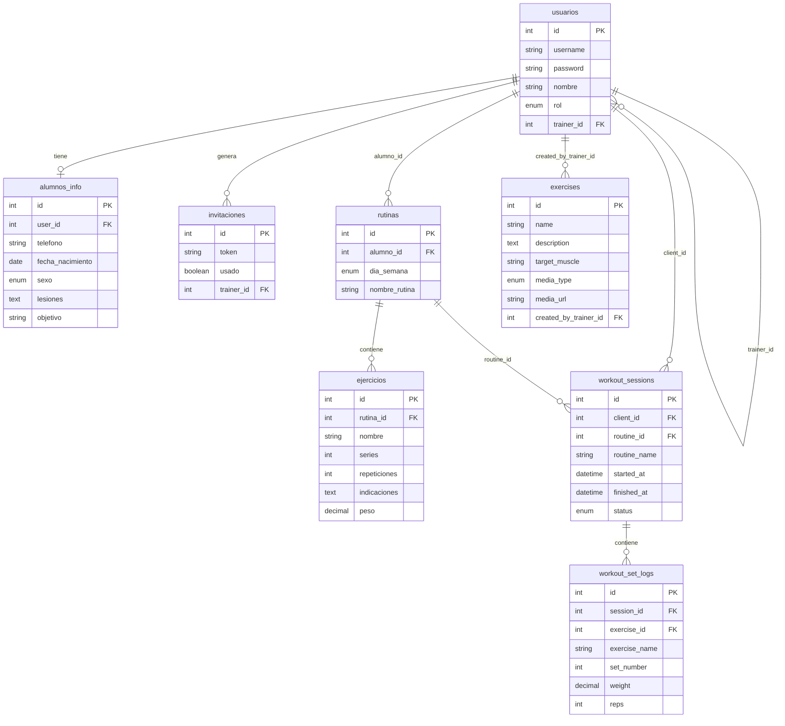

# Esquema de base de datos

Base: `coach_db` (MySQL, utf8mb4). Fuente canónica del DDL: [`backend/db/script_db.sql`](../backend/db/script_db.sql).

## Diagrama de relaciones



## Tablas

### `usuarios`

Login y ownership trainer↔cliente. `rol`: `trainer` | `client`. Los clientes pueden tener `trainer_id` apuntando a su entrenador.

### `alumnos_info`

Perfil extendido del alumno (schema listo; API/UI pendientes de feature dedicada).

### `rutinas`

Rutina diaria asignada a un alumno (`alumno_id` → `usuarios`).

### `ejercicios` (líneas de rutina)

Detalle de una rutina concreta: nombre libre, series, repeticiones, peso e indicaciones. **No** es el catálogo del sistema. El peso aquí es **prescripción**, no historial de ejecución.

### `exercises` (catálogo / diccionario)

Diccionario híbrido de ejercicios (Feature 008):

| Columna | Descripción |
|---------|-------------|
| `id` | PK |
| `name` | Nombre del ejercicio |
| `description` | Descripción opcional |
| `target_muscle` | Grupo muscular objetivo |
| `media_type` | `image` \| `gif` \| `youtube` \| `video` \| `none` |
| `media_url` | URL de media (GitHub, YouTube, hosting del trainer) |
| `created_by_trainer_id` | `NULL` = global del sistema; con ID = privado del trainer (`usuarios.id`) |

**Importante:** `exercises` ≠ `ejercicios`. Las rutinas siguen usando `ejercicios.nombre` como texto libre; la UI del trainer puede elegir del catálogo y copiar el nombre (Feature 009: `GET/POST /api/exercises`).

### `workout_sessions` / `workout_set_logs` (Feature 012)

Ejecución del alumno. `workout_sessions` agrupa una sesión; `workout_set_logs` guarda peso/reps por serie. No reescribe la prescripción.

### `invitaciones`

Tokens de registro generados por un trainer (`trainer_id`).

## Seed del catálogo

Tras crear la tabla `exercises` en MySQL (instancias existentes: `node scripts/createExercisesTable.js`):

```bash
cd backend
node scripts/seedExercises.js
# o: npm run seed:exercises
```

Lee `backend/scripts/exercises_dataset.json` e inserta filas globales (`created_by_trainer_id = NULL`) con prepared statements. Omite nombres globales que ya existan (idempotente por `name`).

## Aplicar tablas de workout (instancias ya existentes)

```bash
cd backend
node scripts/createWorkoutSessionsTables.js
```

O ejecutar el SQL en [`backend/db/migrations/004_workout_sessions.sql`](../backend/db/migrations/004_workout_sessions.sql).
