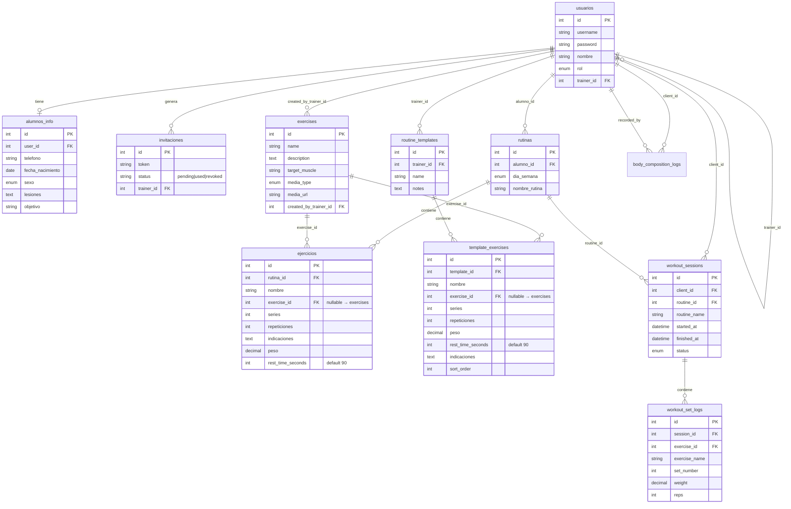

# Esquema de base de datos

Base: `coach_db` (MySQL, utf8mb4). Fuente canónica del DDL: [`backend/db/script_db.sql`](../backend/db/script_db.sql).

## Diagrama de relaciones



## Tablas

### `usuarios`

Login y ownership trainer↔cliente. `rol`: `trainer` | `client`. Los clientes pueden tener `trainer_id` apuntando a su entrenador.

### `alumnos_info`

Perfil extendido del alumno (Feature 020). Relación 1:1 con `usuarios` vía `user_id` (UNIQUE). Campos: `telefono`, `fecha_nacimiento`, `sexo`, `lesiones`, `objetivo`, `foto_url`, `ultimo_acceso`. `foto_url` guarda ruta relativa (`/uploads/avatars/user_<id>.jpg`) o `NULL` (avatar por defecto en frontend).

### `trainers_info`

Perfil extendido del entrenador (Feature 024). Relación 1:1 con `usuarios` vía `user_id` (UNIQUE). Campos: `telefono`, `foto_url`. El nombre sigue en `usuarios.nombre`.

### `rutinas`

Rutina diaria asignada a un alumno (`alumno_id` → `usuarios`).

### `ejercicios` (líneas de rutina)

Detalle de una rutina concreta: nombre (denormalizado), series, repeticiones, peso, `rest_time_seconds` (Feature 028; default 90) e indicaciones. **No** es el catálogo del sistema. El peso aquí es **prescripción**, no historial de ejecución.

**Feature 022:** `exercise_id INT NULL` → FK a `exercises(id)` con `ON DELETE SET NULL`. Si el catálogo borra un ejercicio, la línea de rutina permanece con `nombre` intacto y `exercise_id = NULL`.

**Feature 028:** `rest_time_seconds INT NOT NULL DEFAULT 90` — descanso entre series (0–900). Migración: [`backend/db/migrations/012_rest_time_seconds.sql`](../backend/db/migrations/012_rest_time_seconds.sql). Misma columna en `template_exercises` (se copia al asignar).

### `exercises` (catálogo / diccionario)

Diccionario híbrido de ejercicios (Feature 008):

| Columna | Descripción |
|---------|-------------|
| `id` | PK |
| `name` | Nombre del ejercicio |
| `description` | Descripción opcional |
| `target_muscle` | Grupo muscular objetivo |
| `media_type` | `image` \| `gif` \| `youtube` \| `video` \| `none` |
| `media_url` | URL de media (GitHub, YouTube, hosting del trainer) |
| `created_by_trainer_id` | `NULL` = global del sistema; con ID = privado del trainer (`usuarios.id`) |

**Importante:** `exercises` ≠ `ejercicios`. Las líneas de rutina/plantilla pueden vincularse con `exercise_id` (estable) y siguen guardando `nombre` para display e historial (Feature 022). La UI del trainer elige del catálogo vía `GET/POST /api/exercises`.

### `workout_sessions` / `workout_set_logs` (Feature 012)

Ejecución del alumno. `workout_sessions` agrupa una sesión; `workout_set_logs` guarda peso/reps por serie. No reescribe la prescripción.

### `invitaciones`

Tokens de registro generados por un trainer (`trainer_id`). Columna `status`: `pending` | `used` | `revoked` (Feature 023; reemplaza `usado` BOOLEAN).

Migración: [`backend/db/migrations/009_invites_status.sql`](../backend/db/migrations/009_invites_status.sql).

```bash
cd backend
node scripts/migrateInvitesStatus.js
```

### `routine_templates` / `template_exercises` (Feature 018)

Biblioteca personal del trainer. `routine_templates.trainer_id` aísla ownership. Las líneas viven en `template_exercises` con `exercise_id` opcional → `exercises` (Feature 022, `ON DELETE SET NULL`).

**Deep copy:** al asignar (`POST /templates/:id/assign`) se insertan filas nuevas en `rutinas` + `ejercicios` del alumno (incluye `exercise_id` si existe). No hay FK plantilla↔rutina; editar/borrar la plantilla no muta rutinas ya asignadas.

Migración catálogo link: [`backend/db/migrations/008_exercise_catalog_link.sql`](../backend/db/migrations/008_exercise_catalog_link.sql).

```bash
cd backend
node scripts/createExerciseCatalogLink.js
```

Migración plantillas: [`backend/db/migrations/005_routine_templates.sql`](../backend/db/migrations/005_routine_templates.sql).

```bash
cd backend
node scripts/createRoutineTemplatesTables.js
```

### `body_composition_logs` (Feature 026)

Historial antropométrico N:1 con el cliente (`client_id` → `usuarios`). `recorded_by` → trainer que registró. `bmi` se calcula en el backend (`weight_kg / (height_cm/100)²`); no se confía en el valor del cliente. Circunferencias y `% grasa` opcionales; todas `DECIMAL(5,2)`.

Migración: [`backend/db/migrations/010_body_composition.sql`](../backend/db/migrations/010_body_composition.sql).

```bash
cd backend
npm run db:create-body-composition
# o: node scripts/createBodyCompositionTable.js
```

### `notifications` (Feature 025)

Alertas in-app N:1 con el usuario (`user_id` → `usuarios`). Tipos: `routine_assigned` | `routine_completed` | `system`. `is_read` booleano.

Migración: [`backend/db/migrations/011_notifications.sql`](../backend/db/migrations/011_notifications.sql). Al arrancar, `ensureNotificationsTable` también aplica `CREATE TABLE IF NOT EXISTS`.

```bash
cd backend
npm run db:create-notifications
# o: node scripts/createNotificationsTable.js
```

## Seed del catálogo

Fuente principal: clone local de [wrkout/exercises.json](https://github.com/wrkout/exercises.json) (gitignored en `backend/data/wrkout-exercises/`). El script recorre `exercises/*/exercise.json`, mapea a columnas Trainfit y guarda `media_url` apuntando a `raw.githubusercontent.com` (`images/0.jpg`); no hostea JPG.

Mapeo: `name` ← `name`; `description` ← `instructions` unidos; `target_muscle` ← `primaryMuscles[0]`; `media_type`/`media_url` ← imagen local detectada → URL GitHub. Globales: `created_by_trainer_id = NULL`. Idempotente por `name`.

El archivo `backend/scripts/exercises_dataset.json` (seed español corto) queda como referencia legacy; el seed ya no lo usa.

Tras crear la tabla (`node scripts/createExercisesTable.js` si hace falta):

```bash
git clone --depth 1 https://github.com/wrkout/exercises.json.git backend/data/wrkout-exercises
cd backend
node scripts/seedExercises.js
# o: npm run seed:exercises
# opcional: WRKOUT_EXERCISES_DIR=/ruta/al/clone
```

## Aplicar tablas de workout (instancias ya existentes)

```bash
cd backend
node scripts/createWorkoutSessionsTables.js
```

O ejecutar el SQL en [`backend/db/migrations/004_workout_sessions.sql`](../backend/db/migrations/004_workout_sessions.sql).
