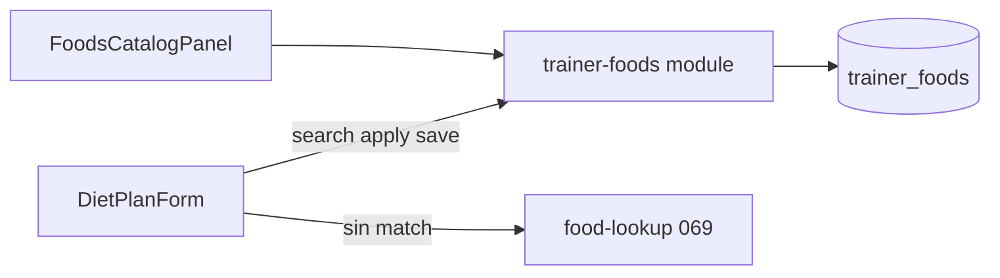

# 070 · Plan técnico — Mis alimentos

## Enfoque

Catálogo persistente por trainer (`trainer_foods`) con seed LATAM idempotente. UI de gestión en Biblioteca (pestaña/ruta hermana de ejercicios). En el editor de dieta, el catálogo es la **primera** fuente de macros; el lookup 069 queda como fallback.

## DB

Tabla `trainer_foods`:

| Columna | Tipo | Notas |
|---------|------|--------|
| `id` | INT PK AI | |
| `trainer_id` | INT FK | `usuarios.id`, ownership |
| `name` | VARCHAR | display; unique por trainer (normalizado en service) |
| `calories` | DECIMAL/DOUBLE | por 100 g/ml |
| `protein_g` | DECIMAL/DOUBLE | |
| `carbs_g` | DECIMAL/DOUBLE | |
| `fats_g` | DECIMAL/DOUBLE | |
| `default_unit` | VARCHAR | default `g` |
| `notes` | TEXT NULL | |
| `created_at` / `updated_at` | TIMESTAMP | |

- Unique: `(trainer_id, name)` — validar colisión case-insensitive en service antes de insert.
- Migración `0XX_trainer_foods.sql` + `ensureTrainerFoodsTable.js` + `script_db.sql` + `docs/database-schema.md`.

## Seed

- Fuente: dataset JSON o módulo JS derivado de [`staticNutrition.js`](backend/src/modules/food-lookup/aliases/staticNutrition.js) (deduplicar keys que apuntan al mismo alimento, ej. huevo/huevos).
- ~20–40 filas: nombre ES, macros/100g, `default_unit: 'g'` (o `ml` para líquidos).
- En `GET /trainer/foods`: si `COUNT(*) = 0` para el trainer → insertar seed en transacción; respuesta incluye los seeds.
- `POST /trainer/foods/seed`: no-op si ya hay filas; útil para tests/manual.

## Backend

Módulo `backend/src/modules/trainer-foods/`:

| Pieza | Rol |
|-------|-----|
| `trainer-foods.routes.js` | paths + auth trainer |
| `trainer-foods.controller.js` | HTTP / JSON |
| `trainer-foods.service.js` | CRUD, seed, search, ownership |
| `seed/latamFoodsSeed.js` | dataset estático |

Montar en [`server.js`](backend/src/server.js) bajo `/api`.

**Contrato listado:** `{ id, name, calories, protein_g, carbs_g, fats_g, default_unit, notes, created_at }` — macros siempre **por 100**.

Escalado al aplicar en FE (o helper compartido):  
`scaled = per_100 * (quantity / 100)` si `unit ∈ {g, ml}`.

## Frontend

### Gestión (Biblioteca)

- Extender [`LibraryView.vue`](src/features/trainer/LibraryView.vue): pestaña **Alimentos** + ruta `/trainer/library/foods` (mismo patrón que `/trainer/library/exercises`).
- Componentes: `FoodsCatalogPanel.vue`, `FoodCatalogForm.vue` (o dialog), API `src/features/trainer/api/trainerFoodsApi.js`.
- Lista con búsqueda; crear/editar/eliminar; empty state “Semilla cargada” / “Añade tu primer alimento”.

### Editor de dieta

- [`DietPlanForm.vue`](src/features/trainer/components/DietPlanForm.vue):
  1. Debounce search → `GET /trainer/foods?q=`
  2. Mostrar sugerencias catálogo (etiqueta “Mis alimentos”)
  3. Selección → aplicar macros escalados
  4. Si no hay resultados → opcionalmente disparar search/lookup 069 (flujo actual)
  5. CTA “Guardar en mis alimentos” si nombre+macros válidos y no existe match por nombre
- No romper varita 069 ni reescalado por cantidad.

## Orden vs 069

| Prioridad | Fuente |
|-----------|--------|
| 1 | `trainer_foods` del trainer autenticado |
| 2 | `GET /trainer/foods/lookup` (069: USDA → static → OFF) |

## Archivos clave (implementación)

- BE: `modules/trainer-foods/*`, migración, ensure, seed
- FE: `trainerFoodsApi.js`, `FoodsCatalogPanel`, `LibraryView` + router, `DietPlanForm`
- Docs: `api.md`, `data-flows.md`, `database-schema.md`

## Seguridad

- Solo rol `trainer`; toda query/mutación filtrada por `req.user.id`.
- Prepared statements; errores `{ success, error, message, code }`.
