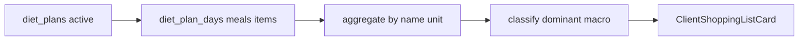

# 071 · Plan técnico — Lista de compra

## Enfoque

Derivar la lista en **lectura** desde el plan activo del cliente (ciclo completo). Sin migración. Reutilizar queries/helpers de [`diet-plans.service.js`](backend/src/modules/diet-plans/diet-plans.service.js) para cargar el plan con días → meals → items.



## Clasificación (macro dominante)

Por cada línea `diet_items` (antes o después de agregar — preferir clasificar **después** de sumar macros del grupo agregado):

1. Comparar `protein_g`, `carbs_g`, `fats_g`
2. Mayor valor → categoría
3. Empate estricto → prioridad `protein` > `carbs` > `fats`
4. Los tres `=== 0` → `other`

Labels ES: Proteínas / Carbohidratos / Grasas / Otros.

## Agregación

- Clave: `${food_name.trim().toLowerCase()}|${unit.trim().toLowerCase()}`
- Sumar: `quantity`, `calories`, `protein_g`, `carbs_g`, `fats_g`
- Contar `occurrences`
- Display name: conservar la primera grafía encontrada (o la más frecuente)

No convertir unidades distintas del mismo alimento (p. ej. `200 g` + `1 unidad` quedan filas separadas).

## Backend

Extender módulo `diet-plans` (cliente):

| Pieza | Cambio |
|-------|--------|
| `diet-plans.service.js` | `getShoppingListForClient(clientId)` |
| `diet-plans.controller.js` | handler JSON |
| `diet-plans.routes.js` (me) | `GET /shopping-list` |

Montaje existente bajo `/api/me/diet-plan/*` — añadir ruta **antes** de params ambiguos si aplica.

**Contrato `data`:**

```json
{
  "plan": { "id": 1, "title": "...", "cycle_length_weeks": 4 },
  "groups": [
    {
      "category": "protein",
      "label": "Proteínas",
      "items": [
        {
          "food_name": "Pechuga de pollo",
          "unit": "g",
          "quantity": 1400,
          "calories": 2310,
          "protein_g": 434,
          "carbs_g": 0,
          "fats_g": 50,
          "occurrences": 14
        }
      ]
    }
  ]
}
```

Orden de grupos fijo: protein → carbs → fats → other. Ítems dentro de grupo: alfabético por `food_name`.

## Frontend

| Archivo | Rol |
|---------|-----|
| `src/features/client/api/dietPlansApi.js` | `getMyShoppingList()` |
| `src/features/client/composables/useShoppingList.js` | carga + checklist localStorage |
| `src/features/client/ClientShoppingListView.vue` | vista dedicada grupos + filtros |
| `src/features/client/components/ClientDietView.vue` | botón carrito → ruta |
| `src/router.js` | `/client/shopping-list` |

- localStorage key: `tf-shopping-checked:{planId}` → array de claves `name|unit`
- Subtítulo: “Todo el plan · N semanas” usando `cycle_length_weeks`
- Reutilizar tokens `--tf-on-surface` / primary; checkboxes con `aria-label` / `aria-pressed`

## Seguridad

- Solo rol `client`; plan filtrado por `client_id = req.user.id` y `is_active` (o convención actual del módulo).
- No exponer planes de otros clientes.

## Archivos clave (implementación)

- BE: `backend/src/modules/diet-plans/*`
- FE: `dietPlansApi.js`, `useShoppingList.js`, `ClientShoppingListView.vue`, `ClientDietView.vue`, `router.js`
- Docs: `docs/api.md`, `docs/data-flows.md`
