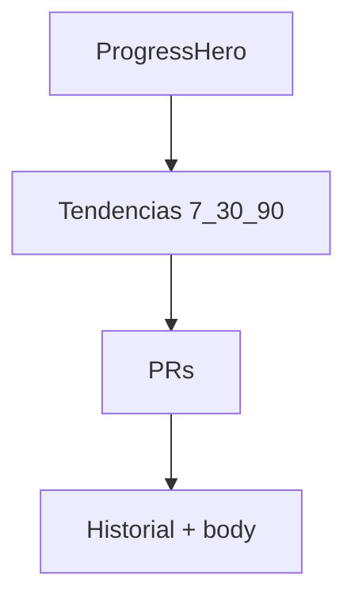

# 072 · Plan técnico — Rediseño Mi progreso

## Enfoque

**Single scroll** (sin tabs Resumen/Gráficas): una composición con secciones ordenadas. Las gráficas se mueven al bloque Tendencias; el historial queda abajo. Reutilizar componentes existentes; extraer/ajustar props donde haga falta.

## Estructura UI

| Sección | Contenido | Componentes base |
|---------|-----------|------------------|
| Header | Título + CTA Check-in | `ClientProgressView` + `WeeklyCheckinDialog` |
| Hero | Racha, sesiones 7d, delta peso | nuevo `ProgressHeroCard.vue` (o refactor de `ProgressKpiStrip`) |
| Tendencias | Chips 7/30/90 + peso/IMC + fuerza + actividad | `ProgressChartsPanel` adaptado + `ProgressActivityBars` |
| Logros | PRs | `PersonalRecordsSection` |
| Historial | Sesiones + body | `ProgressSmartHistory` + `BodyCompositionReadOnly` |

## Variante tabs

**Elegida:** eliminar (o deprecar visualmente) `activeTab` resumen/gráficas. Todo en un scroll. Si el scroll es muy largo en móvil, anclas sticky opcionales (“Resumen · Tendencias · Historial”) — nice-to-have, no bloqueante.

## Filtro 7 / 30 / 90

- Estado local `rangeDays = 7 | 30 | 90` en la vista o en un composable `useProgressRange`.
- Filtrar puntos de `ProgressChartsPanel` / metrics por `measured_at` / fecha de sesión ≥ `now - rangeDays`.
- Actividad semanal: mantener últimas N semanas proporcionales al rango (7→1–2 semanas visuales, 30→~4, 90→~12) o dejar barras de 12 semanas fijas si simplifica — preferir **acoplar al rango** cuando sea barato.

## Delta de peso en hero

1. Cargar `GET /me/body-composition` (ya en flujo o paralelo).
2. Ordenar por `measured_at`.
3. Si ≥2 puntos: `delta = last.weight_kg - previous.weight_kg` (inmediato anterior) **o** vs primer punto del rango 30d — **usar último vs anterior inmediato** para el hero (más simple y “reciente”).
4. Mostrar `+0.4 kg` / `−1.2 kg` / `=` con color semántico sin depender solo del color (icono + texto).

## Archivos clave

| Archivo | Cambio |
|---------|--------|
| [`ClientProgressView.vue`](src/features/client/ClientProgressView.vue) | Quitar tabs; montar secciones |
| Nuevo `ProgressHeroCard.vue` | Hero |
| [`ProgressChartsPanel.vue`](src/shared/components/ProgressChartsPanel.vue) | Prop `rangeDays`; chips rango |
| [`ProgressKpiStrip.vue`](src/features/client/components/ProgressKpiStrip.vue) | Integrar en hero o sustituir |
| `useProgressSessions.js` | Sin breaking changes; filtrar si aplica |

Trainer: `ProgressChartsPanel` con `rangeDays` default 90 o “all” para no romper Client 360.

## Accesibilidad / tema

- Tokens `--tf-on-surface` / muted; CTAs `color="primary"`.
- Chips de rango: target ≥44px en móvil; `aria-pressed` / `aria-label`.
- No overlays opacos Vuetify.

## Orden de implementación sugerido

1. Hero + quitar tabs (layout)
2. Mover charts al scroll + chips rango
3. Pulir empty states y delta peso
4. Ajuste densidad / espaciado móvil
