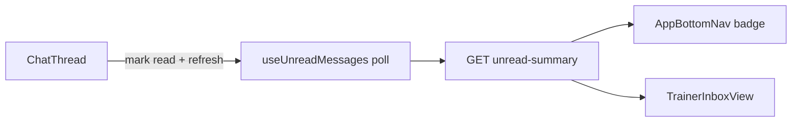

# 073 · Plan técnico — Unread messaging

## Enfoque

Exponer un summary REST y un composable con **poll 45s** (rango 30–60) + refresh on focus. Badge en bottom nav; enriquecer inbox trainer. No cambiar el modelo SSE del hilo abierto.



## Backend

Extender [`messages.service.js`](backend/src/modules/messages/messages.service.js):

```sql
-- Conceptual: unread where receiver_id = :me AND is_read = FALSE
-- Group by sender_id → partnerId, COUNT(*), MAX(created_at), preview from latest row
```

| Endpoint | Notas |
|----------|-------|
| `GET /api/messages/unread-summary` | Montar **antes** de `/:partnerId` para no capturar `unread-summary` como id |

**Contrato:**

```json
{
  "success": true,
  "data": {
    "total": 3,
    "byPartner": [
      {
        "partnerId": 12,
        "count": 3,
        "lastMessageAt": "2026-07-27T20:00:00.000Z",
        "preview": "¿Puedes revisar mi…"
      }
    ]
  }
}
```

Cliente: `byPartner` longitud 0–1 (partner = trainer). Trainer: N clientes.

Validar que cada `partnerId` es un interlocutor permitido (misma regla que el resto del módulo).

## Frontend

| Archivo | Rol |
|---------|-----|
| `src/features/messaging/api/messagesApi.js` | `getUnreadSummary()` |
| `src/features/messaging/composables/useUnreadMessages.js` | estado + poll + `refresh` |
| [`AppBottomNav.vue`](src/shared/layout/AppBottomNav.vue) | badge en item Chat |
| [`TrainerInboxView.vue`](src/features/messaging/TrainerInboxView.vue) | merge summary con lista clientes |
| [`ChatThread.vue`](src/features/messaging/components/ChatThread.vue) / vistas chat | llamar `refresh` tras load |

Poll: `setInterval` 45_000; también `visibilitychange` → refresh si `document.visibilityState === 'visible'`. Limpiar en `onUnmounted`.

Badge estilo alineado a [`NotificationBadge.vue`](src/components/notifications/NotificationBadge.vue) (píldora numérica, contraste on-primary si fondo primary).

## Seguridad

- Solo mensajes donde `receiver_id = req.user.id` y `is_read = FALSE`.
- Trainer no ve unreads de conversaciones ajenas; cliente solo su trainer asignado.

## Archivos clave

- BE: `messages.routes.js`, `messages.controller.js`, `messages.service.js`
- FE: `messagesApi.js`, `useUnreadMessages.js`, `AppBottomNav.vue`, `TrainerInboxView.vue`
- Docs: `api.md`, `data-flows.md`
