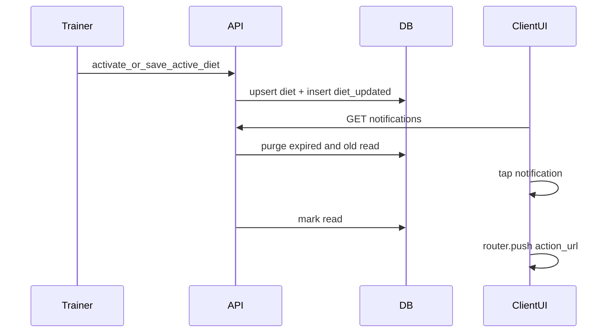

# 074 · Plan técnico — Notificaciones efímeras + deep-links

## Enfoque

Extender la tabla `notifications` con metadata de navegación y caducidad; purgar en listado; cablear dieta y deep-links en UI.



## DB

Migración `0XX_notifications_deeplink_ttl.sql`:

| Columna | Tipo | Notas |
|---------|------|--------|
| `entity_type` | VARCHAR(50) NULL | ej. `diet_plan`, `routine`, `client` |
| `entity_id` | INT NULL | |
| `action_url` | VARCHAR(255) NULL | path app-relative |
| `expires_at` | TIMESTAMP NULL | default app-side +30d |

- `ALTER` ENUM añadir `diet_updated` (MySQL/TiDB: recrear ENUM o columna según patrón del repo en migraciones 020).
- Backfill `expires_at`.
- Actualizar [`ensureNotificationsTable.js`](backend/src/db/ensureNotificationsTable.js).

## Backend

[`notifications.service.js`](backend/src/modules/notifications/notifications.service.js):

- `createNotification({ userId, title, message, type, entityType, entityId, actionUrl, expiresAt })`
- `purgeForUser(userId)`: delete where `expires_at < NOW()` OR (`is_read = 1` AND `created_at < NOW() - 3 DAY`)
- `listForUser`: purge → select last 50 + unread count
- `deleteOne(userId, id)`

Diet — en [`diet-plans`](backend/src/modules/diet-plans/) service/controller tras activate/update activo:

```text
type: diet_updated
title: "Plan nutricional actualizado"
message: "Tu entrenador actualizó «{title}»."
entity_type: diet_plan
entity_id: plan.id
action_url: /client
```

Rutinas / workouts / PR / streak: pasar `action_url` en los `createNotification` existentes (archivos ya auditados: `routines.controller`, `templates.controller`, `workout-sessions.controller`).

## Frontend

| Archivo | Cambio |
|---------|--------|
| [`NotificationBadge.vue`](src/components/notifications/NotificationBadge.vue) | navigate + dismiss |
| [`useNotifications.js`](src/composables/useNotifications.js) | `deleteNotification`, tipar campos nuevos |
| [`notificationsApi.js`](src/shared/api/notificationsApi.js) | `DELETE /:id` |

Mapa iconos: `diet_updated` → `mdi-food-apple` (o similar). Empty copy: rutinas, dieta y progreso.

Navegación: `useRouter().push(notif.action_url)` solo si string empieza por `/` (evitar open redirect).

## Seguridad

- Purge y delete siempre scoped a `user_id = req.user.id`.
- `action_url` generado solo en servidor (no confiar en input de cliente para crear notifs).

## Archivos clave

- Migración + ensure + `script_db.sql`
- `notifications/*`, emitters diet/routines/sessions
- `NotificationBadge.vue`, `useNotifications.js`, `notificationsApi.js`
- Docs: `api.md`, `database-schema.md`, `data-flows.md`
