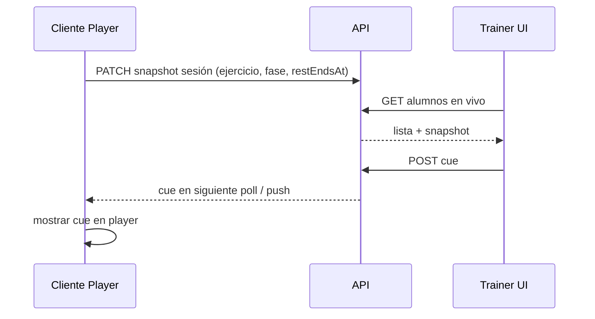

# 076 · Plan técnico — Modo sombra

## Enfoque

Extender el dominio de **sesión de entrenamiento en curso** con un snapshot liviano visible al trainer y un canal de **cues** one-way (trainer → client). MVP preferido: **polling** (simple, alineado al stack Express actual); WebSocket/SSE como evolución documentada en ADR si la latencia no basta.

## Datos (propuesta)

| Entidad | Rol |
|---------|-----|
| `workout_session_live` (o columnas en sesión abierta) | `client_id`, `session_id`, `exercise_id/name`, `exercise_index`, `set_index`, `phase`, `rest_ends_at`, `updated_at`, `shadow_enabled` |
| `workout_session_cues` | `id`, `session_id`, `trainer_id`, `body`, `tone`, `created_at`, `delivered_at`, `acked_at` |

Preferir tabla dedicada de live + cues para no ensuciar el log histórico de series (012).

## API (borrador)

| Método | Ruta | Rol | Notas |
|--------|------|-----|-------|
| `PATCH` | `/api/me/workout-sessions/:id/live` | client | Upsert snapshot; solo sesión propia abierta |
| `GET` | `/api/trainer/live-sessions` | trainer | Alumnos propios con live reciente (`updated_at` < 30 s) |
| `POST` | `/api/trainer/live-sessions/:sessionId/cues` | trainer | Crea cue; valida ownership |
| `GET` | `/api/me/workout-sessions/:id/cues?since=` | client | Poll de cues pendientes |
| `POST` | `/api/me/workout-sessions/:id/cues/:cueId/ack` | client | Marca visto |
| `PATCH` | `/api/me/settings/shadow-mode` | client | Opt-in/out |

TTL: si no hay snapshot en >45 s, considerar sesión “offline” en la lista trainer.

## Frontend

| Superficie | Rol |
|------------|-----|
| Workout Player (059) | Emite snapshot; escucha cues; indicador sombra |
| Hub trainer (nuevo panel o sección Inicio) | “Entrenando ahora” + detalle + composer de cue |
| Ajustes cliente (024/045) | Toggle modo sombra |
| Ficha 360 (opcional) | Historial de cues de la sesión |

## Seguridad

- Ownership estricto: trainer solo sus `client_id`; client solo su sesión.
- Rate-limit cues; sanitizar texto; no exponer IPs ni ubicación.
- Respetar soft-lock membresía (040): si el alumno no puede entrenar, no hay live.

## Riesgos

| Riesgo | Mitigación |
|--------|------------|
| Polling costoso | Intervalo 3–5 s solo con sesión abierta; índice por `updated_at` |
| Trainer “vigilancia” percibida | Opt-out claro + indicador visible |
| Cues ignorados en background | Push opcional (051) si app en background |

## Archivos clave (cuando se implemente)

- BE: módulo `workout-sessions` o `shadow-mode`
- FE: player, panel live trainer, settings
- Docs: `api.md`, `data-flows.md`, ADR transporte
