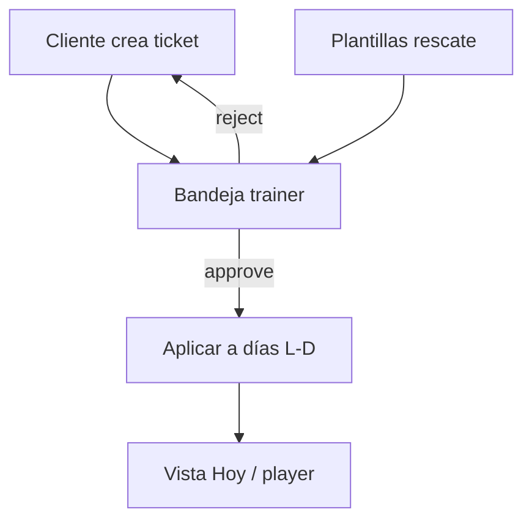

# 077 · Plan técnico — Tickets de semana real

## Enfoque

Introducir un módulo **life-tickets** que orquesta: solicitud del cliente → plantillas de rescate del trainer → mutación acotada de la programación semanal (061) en un rango de fechas.

## Datos (propuesta)

| Entidad | Campos clave |
|---------|----------------|
| `life_ticket_templates` | `trainer_id`, `event_type`, `title`, `strategy` (`swap_template` \| `shorten` \| `home` \| `excuse`), `payload` JSON (ids plantilla, reglas) |
| `life_tickets` | `client_id`, `trainer_id`, `event_type`, `starts_on`, `ends_on`, `note`, `body_area`, `status`, `chosen_template_id`, `resolved_at` |
| `life_ticket_day_effects` | `ticket_id`, `date`, `action` (`replaced` \| `excused` \| `shortened`), `before_ref`, `after_ref` |

`payload` debe ser versionable y validado en service (no confiar en el cliente).

## API (borrador)

| Método | Ruta | Rol |
|--------|------|-----|
| `GET/POST` | `/api/trainer/life-ticket-templates` | trainer |
| `PATCH/DELETE` | `/api/trainer/life-ticket-templates/:id` | trainer |
| `POST` | `/api/me/life-tickets` | client |
| `GET` | `/api/me/life-tickets` | client |
| `GET` | `/api/trainer/life-tickets?status=pending` | trainer |
| `POST` | `/api/trainer/life-tickets/:id/approve` | trainer body: `{ templateId \| strategy: 'excuse' }` |
| `POST` | `/api/trainer/life-tickets/:id/reject` | trainer |

## Reglas de aplicación

1. Resolver días del cliente con sesión planificada en `[starts_on, ends_on]`.
2. Por cada día: clonar/sustituir según strategy; guardar efecto para undo futuro (fase 2).
3. No tocar días fuera de ventana.
4. Membresía soft-lock (040): ticket se puede crear, pero ejecución sigue las reglas de acceso.
5. Transacción: ticket + efectos + cambios de programación en un solo `COMMIT`.

## Frontend

| Superficie | Rol |
|------------|-----|
| Cliente Inicio / Perfil | CTA “Mi semana cambió” → form ticket |
| Trainer Inicio | Badge tickets pendientes |
| Ficha 360 | Historial + approve inline |
| Trainer ajustes/biblioteca | CRUD plantillas de rescate |

## Seguridad

- Ownership trainer↔client en todos los endpoints.
- Validar fechas (fin ≥ inicio, máx. 14 días).
- No permitir approve de tickets de otro trainer.

## Riesgos

| Riesgo | Mitigación |
|--------|------------|
| Rescate rompe mesociclo | Efectos auditables; copy “días adaptados” |
| Abuso de excused | Límite de días excused / mes configurable (default 4) |
| Sin plantillas | Flujo “excusar” o “rechazar pidiendo más info” |

## Archivos clave (cuando se implemente)

- BE: `modules/life-tickets/`
- FE: features client + trainer
- Integración con programación 061 y score/racha 042
