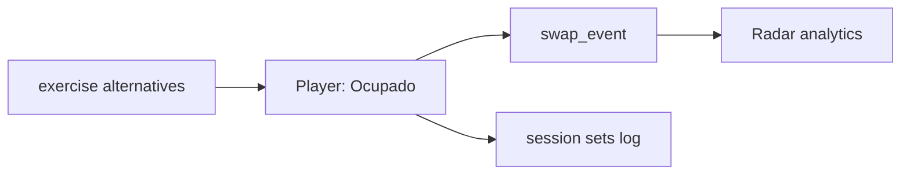

# 078 · Plan técnico — Radar de ocupación del gym

## Enfoque

Separar **configuración de alternativas** (trainer) de **eventos de swap en sesión** (cliente) y de **agregaciones de analytics** (lectura trainer).



## Datos (propuesta)

| Entidad | Rol |
|---------|-----|
| `exercise_alternatives` | `trainer_id` nullable (global trainer vs system), `exercise_id`, `alt_exercise_id`, `priority`, `active` |
| `routine_line_alternatives` | override opcional por línea de plan asignado |
| `workout_swap_events` | `session_id`, `client_id`, `from_exercise_id`, `to_exercise_id`, `reason` (`equipment_busy`), `at_set_index`, `created_at` |

Índices: `(trainer_id, from_exercise_id, created_at)` vía join client→trainer para el radar.

## API (borrador)

| Método | Ruta | Rol |
|--------|------|-----|
| `GET/PUT` | `/api/trainer/exercises/:id/alternatives` | trainer |
| `GET` | `/api/me/workout-sessions/:id/exercises/:exerciseId/alternatives` | client (solo las permitidas) |
| `POST` | `/api/me/workout-sessions/:id/swaps` | client body: `{ fromExerciseId, toExerciseId, reason }` |
| `GET` | `/api/trainer/occupancy-radar?range=30d&clientId=` | trainer |

**Respuesta radar (ejemplo):**

```json
{
  "range_days": 30,
  "top_blocked": [
    {
      "exercise_id": 12,
      "name": "Press banca",
      "swap_count": 18,
      "session_count": 40,
      "swap_rate": 0.45,
      "top_destinations": [{ "exercise_id": 44, "name": "Press mancuernas", "count": 11 }]
    }
  ]
}
```

## Player

1. Usuario pulsa Ocupado.
2. FE pide alternativas; si vacío → empty state + skip opcional.
3. Confirma destino → `POST /swaps` → motor de sesión reemplaza el ejercicio actual (y superserie si aplica: solo el slot afectado).
4. Series siguientes loguean `exercise_id = to`.

## Seguridad

- Cliente solo puede elegir `to_exercise_id` ∈ alternativas autorizadas (validar en service, no solo UI).
- Radar solo alumnos con `trainer_id = req.user.id`.
- No filtrar PII innecesaria en agregados.

## Riesgos

| Riesgo | Mitigación |
|--------|------------|
| Alternativas mal emparejadas (patrón distinto) | UI sugiere mismo músculo/patrón (046) como ayuda, no bloqueo duro en MVP |
| Contar swaps duplicados | Un swap por ejercicio “activo” hasta completar o re-swap |
| Analytics ruidosos con pocos datos | Mostrar “datos insuficientes” bajo N sesiones |

## Archivos clave (cuando se implemente)

- BE: exercises + workout-sessions + endpoint radar
- FE: player sheet, trainer alternatives editor, vista Radar
- Docs: api + data-flows
