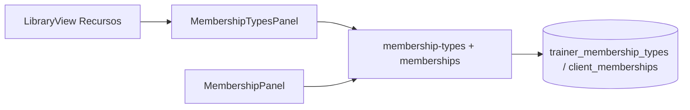

# 079 · Plan técnico — Tipos de membresía

## Enfoque

Catálogo `trainer_membership_types` + asignación en `client_memberships` (snapshot). UI en hub **Recursos** (rutas `/trainer/library*`).

## DB

Ver spec. Ensure: CREATE TABLE tipos + ADD COLUMN en memberships si faltan.

## Backend

- `backend/src/modules/membership-types/`
- Extender `memberships.service.js` (map + upsert + getForClient)

## Frontend

- Renombrar label nav/header a Recursos
- Tabs + `MembershipTypesPanel.vue` + stub Dietas
- MembershipPanel + copy cliente + `formatMoneyCop` helper
