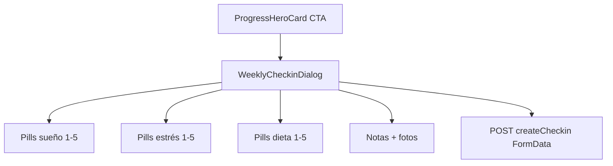

# 081 · Plan técnico — Alineación UI check-in

## Enfoque

Restyle de [`WeeklyCheckinDialog.vue`](../../../src/features/client/components/WeeklyCheckinDialog.vue) siguiendo el chrome de `mtp-dialog` (membresías) y pills tipo `mtp-presets`. Un solo SFC; escala 1–5 con `radiogroup` por métrica.

## Archivos

| Archivo | Cambio |
|---------|--------|
| `WeeklyCheckinDialog.vue` | Header mtp-style; pills; CTAs; CSS tokens |
| `spec/features/081-.../` | Spec / plan / tasks |

Sin cambios en `checkinsApi.js` ni backend.

## Detalle UI

1. `v-dialog` + `v-card` `rounded="xl"` `bg-color="surface"` + borde sutil.
2. `v-card-item`: icono `mdi-clipboard-check-outline`, título, subtítulo, close.
3. Filas métrica: label + icono muted + `n/5` primary; pills `SCALE = [1..5]`.
4. Acciones flex 1:1, min-height 44px.
5. CSS: `.checkin-scale__btn` / `--on`; `:focus-visible`.

## Accesibilidad / tema

- Tokens `--tf-on-surface` / `--tf-on-surface-muted` / `--tf-primary`.
- No `outline: none` sin reemplazo.
- Checklist ADR-0001 / ADR-0002 al cerrar.

## Validación

- `npm run build` FE.
- Smoke visual ~390px.
