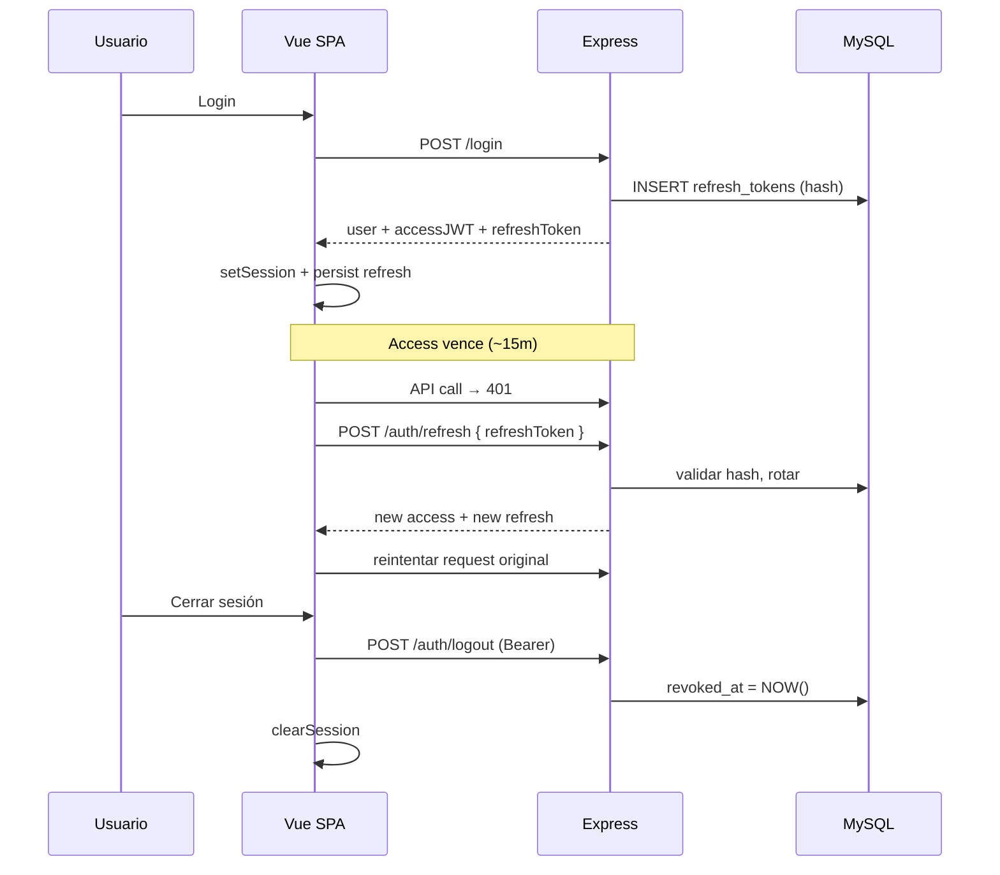

# 083 · Plan técnico — sesión persistente

## Enfoque

Mantener el modelo actual **JWT access + Bearer** (compatible con SSE `?token=` y uploads privados) y añadir **refresh tokens opacos en MySQL**, con rotación y revocación en logout.

No adoptar BFF/Redis en esta feature (fuera de alcance): es el salto de seguridad “ideal” pero cambia demasiado el despliegue. El ADR documenta por qué y la deuda.

## Decisiones de diseño

| Tema | Decisión MVP | Motivo |
|------|-------------|--------|
| Access TTL | `15m` (env `JWT_EXPIRES_IN`) | Ventana corta si se filtra el Bearer |
| Refresh TTL | `30d` sliding al usar `/auth/refresh` | “No login diario”; solo logout o inactividad larga |
| Formato refresh | Opaco (`crypto.randomBytes`) + `SHA-256` en DB | Igual que reset password (056); revocable |
| Rotación | Sí: cada refresh invalida el anterior | Mitiga replay |
| Reuse detection | Si hash ya `revoked`/`replaced` → revocar refreshes activos del `user_id` | BCP OAuth / guías SPA |
| Storage refresh FE | **Fase A:** body + `localStorage` (`refreshToken`) | Mismo origen XSS que el JWT actual; cero fricción CORS |
| Cookie HttpOnly | **Fase B (opcional misma feature si da tiempo)** | Requiere `cors({ credentials: true })`, `withCredentials`, `SameSite=None; Secure` en prod cross-origin |
| Access storage | Sigue en `localStorage` (`authToken`) en MVP | Evita romper bootstrap; refresh silencioso en load |
| Logout | `POST /auth/logout` + clear local | Cumple “solo cierra si el cliente lo cierra” |

**Recomendación de implementación inmediata:** Fase A (localStorage) para desbloquear UX; dejar Fase B cookie como tarea opcional / follow-up si CORS ya está limpio en prod.

## Flujos

## Archivos clave

| Capa | Path |
|------|------|
| Env | `backend/src/config/env.js`, `.env.example` (`REFRESH_TOKEN_EXPIRES_IN`) |
| Migración | `backend/db/migrations/034_refresh_tokens.sql` |
| Ensure | `backend/src/db/ensureRefreshTokensTable.js` |
| Auth service | `backend/src/modules/auth/auth.service.js` (+ helper refresh) |
| Auth routes | `POST /auth/refresh`, `POST /auth/logout` |
| Middleware | sin cambio de contrato `authenticate` (sigue JWT access) |
| FE session | `src/shared/auth/session.js` |
| FE HTTP | `src/shared/api/http.js` (single-flight refresh) |
| FE logout | `useSessionAccount` / AppShell paths |
| Docs | `docs/api.md`, `docs/data-flows.md`, ADR-0007 |

## Riesgos y mitigaciones

- **Race de N requests 401:** cola single-flight (una sola promise de refresh compartida).
- **Bucle redirect:** no limpiar sesión en 401 de `/auth/refresh` / login / register / forgot|reset.
- **Tokens en logs:** no loguear refresh ni access.
- **Prod JWT_SECRET:** ya obligatorio; refresh no usa el mismo JWT secret para firmar (es opaco).
- **Cambio de password:** follow-up revocar todos los refresh del user.

## Skills / checklist auth

- [ ] `req.user` solo desde access JWT verificado
- [ ] Refresh no concede datos de negocio; solo emite nuevos tokens
- [ ] Ownership/roles intactos
- [ ] Sin secretos en respuestas de error
