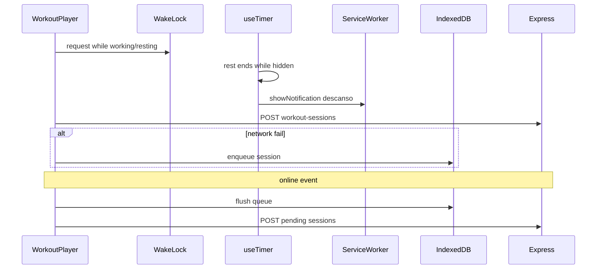

# 086 · Plan técnico

## Component map (FE)

| Pieza | Responsabilidad |
|-------|-----------------|
| `useWakeLock` | Pedir/liberar/re-adquirir Screen Wake Lock |
| `useTimer` (+ extensión) | Al completar descanso oculto → notificación local |
| `useWorkoutSession` / `WorkoutPlayerView` | Activar Wake Lock en fases activas |
| `restNotify.js` + `sw.js` | Mostrar notificación local “Descanso terminado” |
| `usePushNotifications` + `useAppPresence` | Re-bind push al volver visible |
| `offlineWorkoutQueue.js` | IndexedDB enqueue / list / dequeue |
| `useOfflineWorkoutSync` | Flush en `online` + mount AppShell (cliente) |
| `WorkoutPlayerView` | Persist con fallback a cola + copy UX |

## Flujos

## Decisiones

1. **Sin migración MySQL** en MVP: dedup por `routine_id` + `started_at` en cliente (+ skip si GET ya tiene match).
2. Wake Lock solo en player (no shell global).
3. Notificación de descanso reutiliza permiso push ya concedido; si `denied`/`default`, solo beep al volver.
4. Push re-bind soft: no pedir permiso de nuevo en cada `visibilitychange`.

## Orden

1. SDD + roadmap  
2. Wake Lock + rest local notify  
3. Push harden (visible rebind + SW click)  
4. Offline queue + flush UI  
5. Docs + build  
