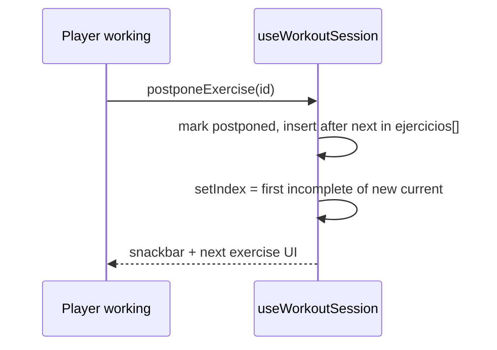
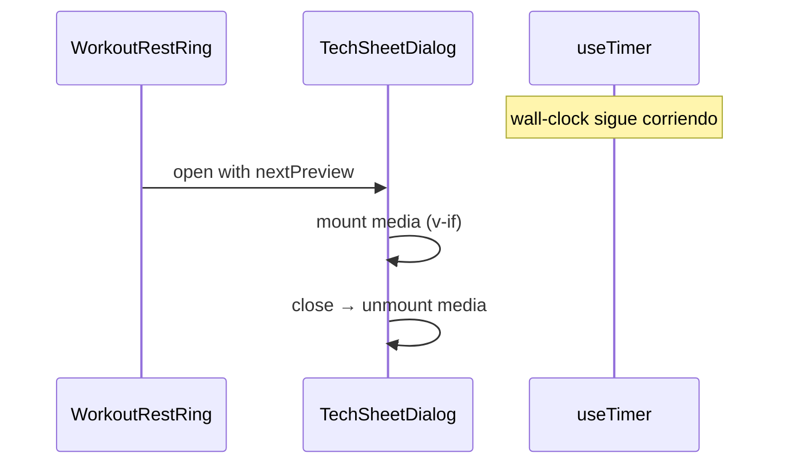

# 087 · Plan técnico

## Component map (FE)

| Pieza | Responsabilidad |
|-------|-----------------|
| `useWorkoutSession.postponeExercise` | Marcar ejercicio, `splice` + insertar en `fromIndex+1` (tras el siguiente), mantener índice → siguiente inmediato |
| `WorkoutPlayerView` | CTA «Máquina ocupada» + snackbar; cablear `postponeExercise` |
| `WorkoutRestRing` | Up next tappable → emit `preview` (el “RestTimer” del brief) |
| `NextExerciseTechSheetDialog` | `v-dialog` ficha técnica; media solo mientras abierto (`v-if`) |
| `WorkoutExerciseMedia` | Reuso: video muted autoplay loop |

## Flujo Posponer

## Flujo Ficha en descanso

## Decisiones

- Mutación inmutable del array (`[...list]` + reassign `routine`) para reactividad con `shallowRef(routine)`.
- Identidad por `ejercicios.id`; fallback índice actual.
- Modal no usa `persistent` forzado; el timer no depende del DOM.
- Musculatura: enriquecer SELECT de catálogo (`target_muscle`, `target_muscle_es`, `primary_muscle`); UI usa `displayExerciseMuscle` + fallback “Sin etiquetar”.
