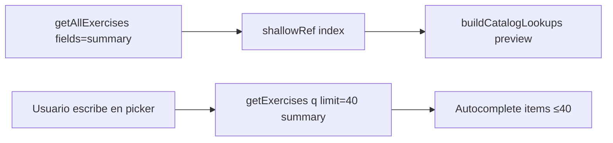

# 089 · Plan técnico

## Component / module map

| Pieza | Responsabilidad |
|-------|-----------------|
| `src/router.js` | Lazy routes; Login eager |
| `src/components/Dashboard.vue` | `defineAsyncComponent` por rol |
| `Client360View.vue` | Async tabs/paneles pesados |
| `LibraryView.vue` | `TemplateFormDialog` async |
| `exercisesApi.js` | `fields=summary` + search helpers |
| `Client360Programming` / `TemplateFormDialog` / `RoutineDayBuilder` | Índice slim + picker search ≤40 |
| `exercises.service.js` | Proyección `fields=summary` |
| `diet-plans.service.js` | `listDietPlans(..., { summary })` |
| Media components | `loading="lazy"` / `preload="none"` offscreen |

## Flujo catálogo (después)

## Riesgos

- Autocomplete UX: debounce + empty query → mostrar primeros N o vacío guiado.
- Callers de diets list que asumen `days` en la respuesta de listado → usar summary solo donde la UI no lee el árbol.
- Compat API: sin flag = payload completo (no romper clientes externos).
